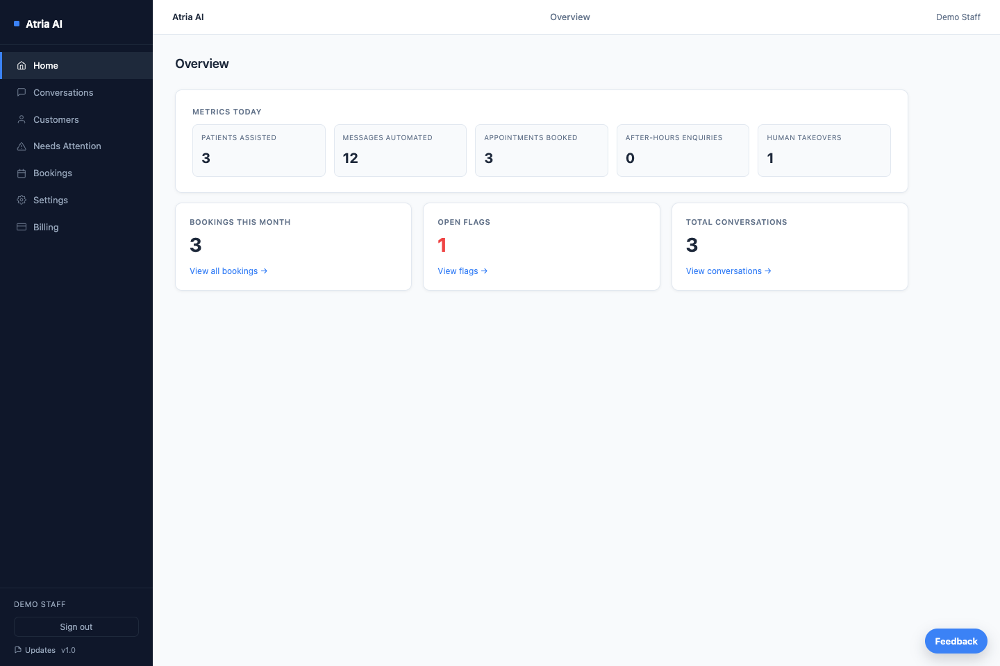
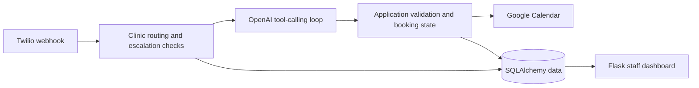
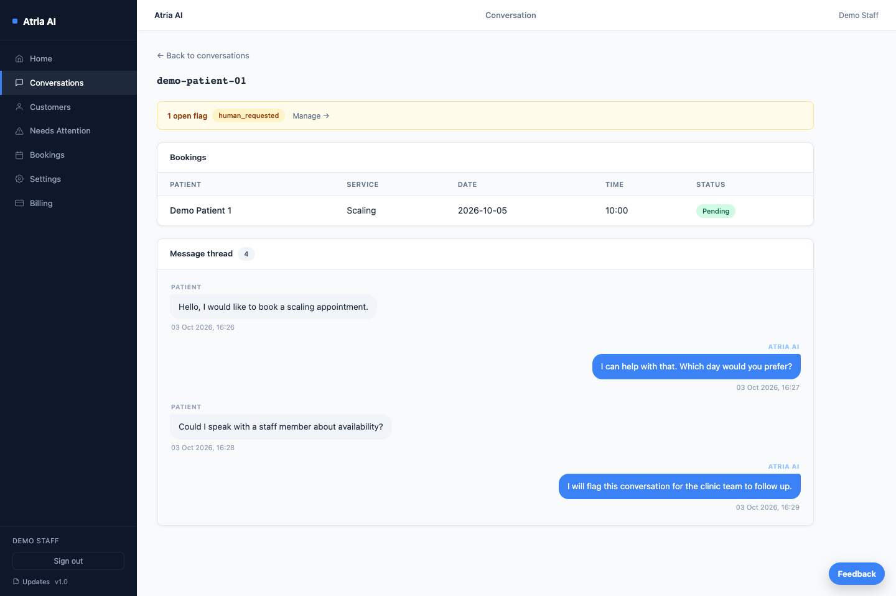

# AI Dental Receptionist

A Python/Flask application exploring how a conversational assistant can help with dental appointment enquiries while keeping booking decisions in application code.

**Independent project; not used by real clinics.** It combines OpenAI tool calling, Google Calendar booking workflows and a staff dashboard. The main engineering challenge is making a useful conversation interface without treating model output as an authoritative booking result.



## Booking logic comes before confirmation

Incoming Twilio WhatsApp messages select a clinic from the destination number. Clinic configuration supplies services, hours, closures and calendar details. The assistant can request availability checks, bookings, rescheduling and cancellation through function tools; the application dispatches those calls and validates the workflow.

- Deterministic date/time parsing and availability checks account for opening hours, lunch breaks, closures and the booking horizon.
- Booking state and tool handlers enforce prerequisites before calendar actions. The assistant is instructed to confirm only after a successful booking result.
- Family bookings are stored by calendar event ID so one phone can hold multiple appointments.
- Human escalation detection runs before the LLM. Staff can review conversations and resolve attention flags.
- Reminder tasks track delivery flags for one-day and two-hour reminders.

These safeguards constrain AI actions; they do not make every generated reply infallible.



## Implementation

Python, Flask, SQLAlchemy, SQLite/PostgreSQL, OpenAI, Twilio, Google Calendar API, Jinja templates and bcrypt. Optional Sentry monitoring and Telegram staff alerts are supported.

[`app.py`](app.py) owns configuration, models, routing and the AI loop; [`booking.py`](booking.py) handles calendar workflows; [`utils.py`](utils.py) resolves dates and times; [`dashboard.py`](dashboard.py) provides staff views. Dashboard queries are scoped to the logged-in staff member's clinic. Twilio signatures, staff authentication and shared-secret task headers protect the relevant entry points.

## Evidence and preview

**570 tests passed locally on 4 October 2026.** The pytest suite exercises booking validation, multi-patient flows, clinic separation, reminders, escalation, staff accounts and security configuration. External-service calls are mocked; this is not evidence of a live clinic deployment.

```bash
python -m pytest -q
```



Both screenshots show the actual dashboard backed by an isolated SQLite database. Patients, conversations, appointments and metrics are synthetic; the displayed replies were seeded, not generated in a live OpenAI session. No messages were sent and no calendar was contacted. There is no public hosted demo. See [capture notes](docs/media/README.md).

## Run locally

```bash
python3 -m venv .venv
source .venv/bin/activate
pip install -r requirements.txt pytest
cp .env.example .env
```

Edit `.env`: use `APP_ENV=development`, `DATABASE_URL=sqlite:///app.db` and your own `OPENAI_API_KEY`. Leave optional integrations unset until you configure them. The application does **not** load `.env` automatically:

```bash
set -a
source .env
set +a
python app.py
```

The development entry point seeds a demo clinic and serves on port 3000. In another terminal with the same environment loaded, run `python seed_staff.py` to create your own login, then open `/dashboard/login`. `/chat` is a development conversation test page; sending messages can call OpenAI and configured integrations. Real booking flows require a Google service account and a calendar shared with it. Twilio delivery requires your own account and webhook setup. [.env.example](.env.example) documents the settings.

## Current boundaries

The project has not been validated in clinic operations. Much of the backend remains in a large application module, and schema changes use hand-written startup SQL rather than a migration framework. Some conversational state is in memory, so process restarts can interrupt an ongoing flow. Calendar/WhatsApp integration behaviour needs separate testing with configured accounts. Tests currently emit datetime deprecation warnings.
